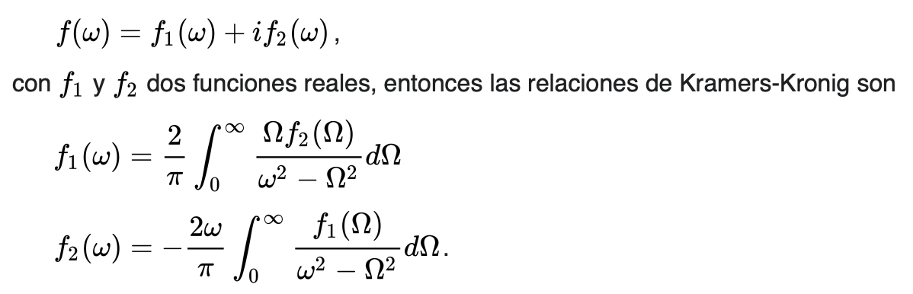
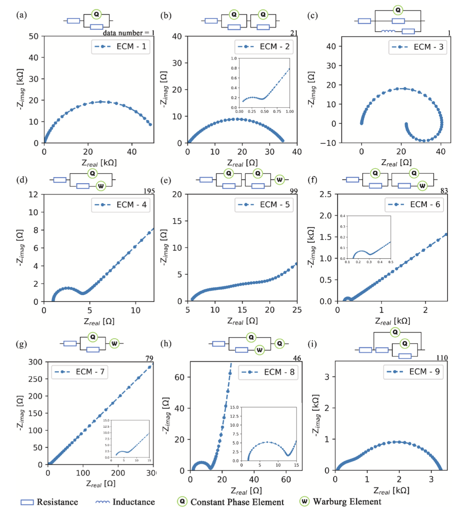

# EIS equivalent circuit model

 > "In an EIS test, a small sinusoidal excitation is applied on the tested electrochemical system whose response in time domain is collected and transformed into impedance in frequency domain using Discrete Fourier Transform" [^1]

 > "EIS ... should be validated by Kramers-Kronig Relation before further analysis" [^1]

<figure markdown="span">
  { width="400" }
  <figcaption>Kramer-Kronig relations</figcaption>
</figure>

 > "To represent kinetics process, equivalent circuit model (ECM)
 is favored because its circuit elements have explicit physicochemical
 meaning and its applications have been extensively validated, and (ordinary
 or partial or fractional-order) differential equation derived from
 physical and chemical model is seldomly chosen because it is difficult to
 be solved and the physicochemical meaning of its elements is still in
 construction" [^1]

## Methods to pick reasonable Equivalent Circuit Model (ECM)

1. > "Choose the types, numbers and connection order of circuit elements in an ECM
 according to the shapes and trends of the Nyquist and Bode plots of an
 impedance spectrum and the related factors of the tested system" [^1]

2. > "Each circuit element should possess explicit physicochemical meaning, and their combination,
  the ECM, should represent a reasonable integration of several
  electrochemical processes" [^1]

This method requires cooperation between researchers and software.

3. > "The precision of ECM parameter identification should reach a required level" [^1]

This method is based on data driven ML, capable of finding correlqtions among numerous variables.

4. Pick the simplest possible ECM

| Reference   | Description  |  Accuracy   |
| :-----: | :------: | :------: |
| Miyazaki et al. | resistances and capacitors  |  0.9 | 
| Kobayashi et al. |  complex non-linear least squares and data mining |  |
| Zhu et al. | SVM with hyperparameter optimization  | 0.48  | 

!!! note "Key phrase"
    > "The study of using **interpretable** ML model to predict ECM is urgently
     needed" [^1]

## Softwares available

The following software uses Local Optimization (typically Complex Non-Linear Least Squares -CNLS-).

- Gamry
- Echem Analyst
- ZSimpWim
- LEVM / LEVMW (open source)
- EQIVCT (open source)
- PyEIS (open source)

!!! note "CNLS based software drawback"
    Initial value close to *local optima* or far from *global optima* will trap CNLS at a local optima

To overcome the initial value issue:

- GUI help adjusting (manually and visually) initial values
- Global Optimization algorithms explore parameter space more sufficiently
- ML models represent *approx.* mapping between EIS and ECM

## ML models

- KNN
- Logistic regression classifier
- Naive Bayes Classifier
- SVM
- Decision Tree
- Random Forest
- AdaBoost

## ECM used
<figure markdown="span">
  { width="400" }
  <figcaption>ECM used</figcaption>
</figure>

### Training Dataset

Collected by Zhu et al. from [Equivalent circuit model recognition of electrochemical impedance spectroscopy via machine learning](https://github.com/Shan-Zhu/ML-EIS/blob/master/EIS-Data-Raw.csv) and by Lai et al. from a "group of local high-throughput electrochemical experiments" [Identifying degradation patterns of lithium ion batteries from impedance spectroscopy using machine learning]()

[^1]: https://www.sciencedirect.com/science/article/pii/S0013468622005126?via%3Dihubß

### Loss function 

- Accuracy
- Kappa  (defined in [A coefficient of agreement for nominal scales](https://journals.sagepub.com/doi/10.1177/001316446002000104))

## Workflow
### Part 1

Choose the best interpretable ML model for each ECM.

### Part 2

Choose 5 best Global Optimization Algorithms for each ECM.