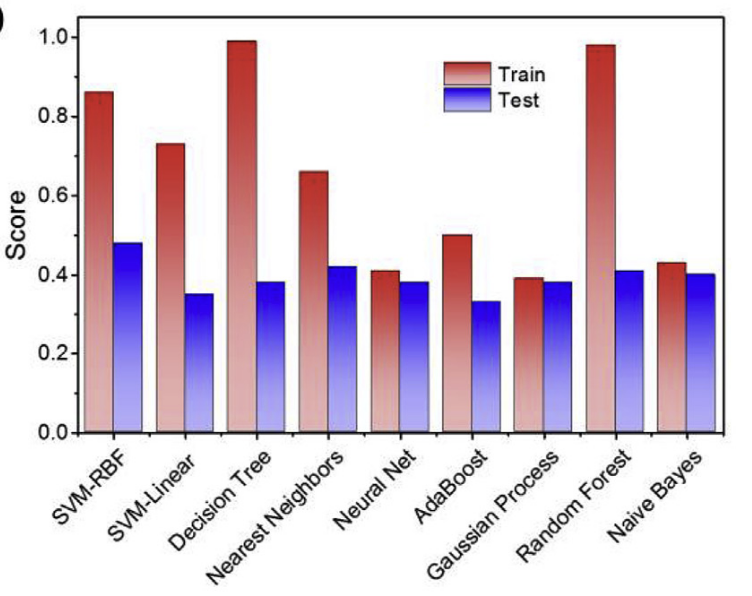

# Suitable equivalent circuit

 > "How to choose the suitable equivalent circuit model is the critical step since the consequence discussion is based on the assumption that there is an accurate model... At present, the common way is screening out several potential
models according to the different applications, and then using mathe-
matical fitting to simulate the corresponding pattern" [^1].

# Dataset

Gotten "from 500 sets of EIS data and their equivalent circuits from published papers" [^1].

Labels for the dataset (Equivalent Circuit Models) are chosen by researchers from the papers, making the choice of the label a careful process.

# Algorithms

<figure markdown="span">
  { width="400" }
  <figcaption>Algorithms comparison</figcaption>
</figure>

!!! note "Note about Neural Net in the picture above"
    The "Neural Net" shown in the chart is a 1-
    layer NN (MLP). The authors didn't try a deep neural network. 

The score is computed as with the accuracy_score from sklearn.

[^1]: https://www.sciencedirect.com/science/article/pii/S1572665719308951?via%3Dihub